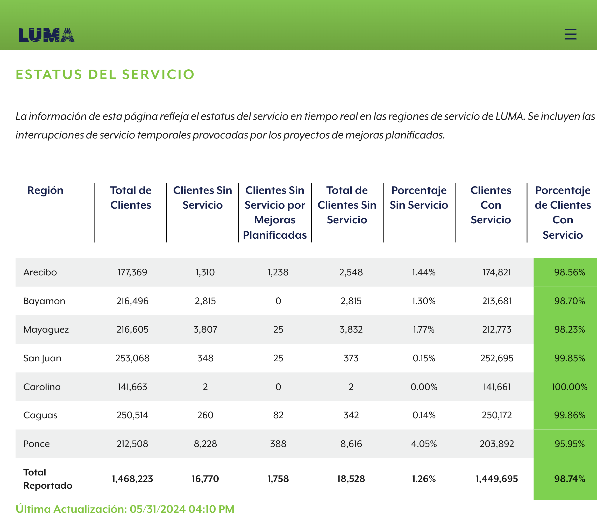

# luma-estatus

Guarda una captura de pantalla de la tabla del estatus de servicio de LUMA:

## Requerimientos

Necesitas Node.js para correr este código. El script para descargar la captura de imagen actual corre solo.

Si quieres correr el script para upload la imagen resultante a una cubeta S3, necesitas crear un archivo `.env' con las siguientes variables:

- ENDPOINT
- ACCESS_KEY_ID
- SECRET_ACCESS_KEY

Tambien hay un Github Workflow titulado 'Captura' que realiza todos estos pasos pero tienes que definir estas variables en los repository secrets.

## Pasos para correr

1. Instala dependencias con `npm i`
2. Una de las siguientes:
    - Si solo quieres descargar la imagen actual, usa `npm run download` y ya acabaste.
    - Si quieres descargar y tambien upload la imagen, usa `npm run start:local` para referenciar tu archivo `.env`. Si ya dichas variables estan definidas en tu ambiente, puedes usar solamente `npm run start`